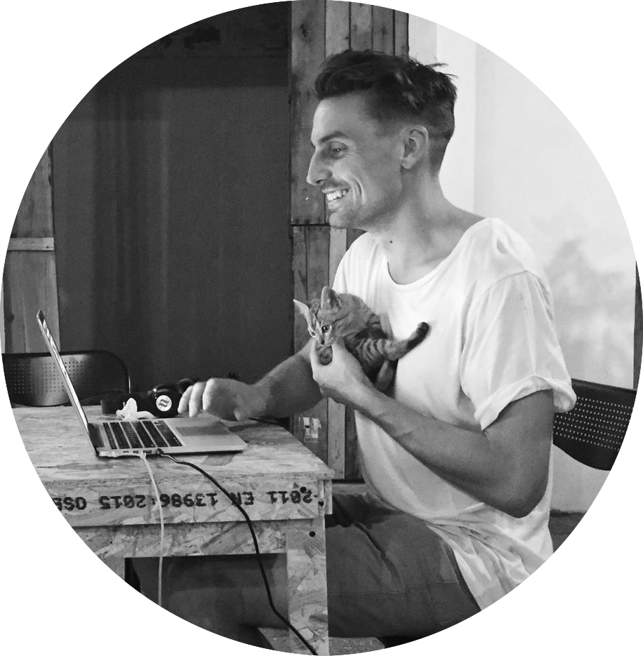

```{r, set-options, echo = FALSE, cache = FALSE}
knitr::opts_chunk$set(
 eval = T, # run all code
 echo = F, # show code chunks in output 
 tidy=T, # make output as tidy
 message = F,  # mask all messages
 warning = F, # mask all warnings 
 out.width="100%",
 size="small", # set code chunk size, 
 knitr::opts_chunk$set(fig.pos = 'H')
)
# options(width = 2000)
# get device output size
# dev.size("px")
```

<!-- install packages -->
```{r, load packages, include=T, cache=F, message=F, warning=F, results='hide',echo=F}
packages <- c("ggplot2","dplyr","tidyverse","zoo","RColorBrewer","viridis","plyr","leaflet","plotly","widgetframe","geosphere","lubridate","ggthemes","gridExtra","crosstalk")  
if (require(packages)) {
    install.packages(packages,dependencies = T)
    require(packages)
}
suppressPackageStartupMessages(
  lapply(packages,library,character.only=T) 
)

# update packages 
# update.packages(ask = FALSE, checkBuilt = TRUE)

require(RCurl)
require(RColorBrewer)
require(dplyr)
require(plotly)
script <- getURL("https://raw.githubusercontent.com/darwinanddavis/plot_it/master/plot_it.R", ssl.verifypeer = FALSE)
  eval(parse(text = script))
  # Set global plotting parameters
  cat("plot_it( \n0 for presentation, 1 for manuscript, \nset colour for background, \nset colour palette 1. use 'display.brewer.all()', \nset colour palette 2. use 'display.brewer.all()', \nset alpha for colour transperancy, \nset font style \n)")
  plot_it(0,"blue","Set3","Spectral",0.8,"") # set plot function params       
  plot_it_gg("black","white") # same as above for ggplot 

```

<!-- ____________________________________________________________________________ -->
<!-- start body -->

<!-- <a href="https://darwinanddavis.github.io/conference_sites/" title="Should work">Work</a> -->


<!-- ________________________________________________________ slide break -->

<p class="small">
Best viewed in Chrome  
Press `F` for fullscreen
Slides are interactive  
</p>

<!-- ________________________________________________________ slide break -->

# {data-background="img/dv2.png" data-background-size="contain" data-background-repeat="repeat"} 

---    



### Born 
Melbourne, Australia  

### Education
PhD, Computational Biology, University of Melbourne    
BSc (Hons), Monash University  

### Interests  
Cartography, data viz, writing  

<!-- ________________________________________________________ slide break -->
# Places I've lived 

<!-- ________________________________________________________ slide break -->
# {data-background-iframe="https://darwinanddavis.github.io/mybio/map1.html"}

<!-- ________________________________________________________ slide break -->

# Places I've worked    

<!-- ________________________________________________________ slide break -->

---    


<br>  


<!-- ________________________________________________________ slide break -->

# Why I make a great data storyteller 

<!-- ________________________________________________________ slide break -->

---    

### Data analysis  

I love turning this

```{r,echo=T,eval=T}
readr::read_csv("data/ds.csv") %>% str
```

<center> **into this ...** </center>

<!-- ________________________________________________________ slide break -->
# {data-background="img/dv1.png" data-background-size="99.99% 99.99%" data-background-repeat="repeat"} 

<!-- ________________________________________________________ slide break -->
# {data-background="img/dv2.png" data-background-size="99.99%" data-background-repeat="repeat"} 

# {data-background-iframe="https://darwinanddavis.github.io/mybio/dv1.html"}

# {data-background-iframe="https://darwinanddavis.github.io/mybio/dv2.html"}

<!-- ________________________________________________________ slide break -->

---

### Communication

<br>

I have 10 years experience as a freelance copy-editor and have edited 400+ documents to date across ~175 journals. 

I've also published both technical and non-technical pieces, including research articles, book chapters, blog posts, policy documents, and annual reports ...  

<!-- ________________________________________________________ slide break -->

# {data-background-iframe='https://www.ncbi.nlm.nih.gov/pubmed/27624673'}  

# {data-background-iframe="https://scholar.google.com.au/citations?hl=en&user=m3MVeUMAAAAJ&view_op=list_works&gmla=AJsN-F58EZe-Cdjk9fe0sjf29ud3SqYLqrNoorVRY1JwBUfNmg5S3qBFrgj8LGcSzn8kthUXY089QBXRRQQ5I-4NieyUoif4UXjJbF0Af_I4qG2j0lYgjvs"}  

# {data-background-iframe="https://theplusones.com/melbourne/2017/03/24/koyaanisqatsi-live-philip-glass-ensemble/"}    

---  

... and given invited seminars on research and data analysis here ...  

# {data-background-iframe="https://darwinanddavis.github.io/mybio/map2.html"}

<!-- ________________________________________________________ slide break -->

# Some of my data science projects  

<!-- ________________________________________________________ slide break -->

# {data-background-iframe='https://darwinanddavis.github.io/EmoRyCodingClub/index.html'}

# {data-background-iframe="https://darwinanddavis.github.io/DataPortfolio/"}

---  

### Thanks for playing  

<br>
  


<!-- end body -->  
<!-- ____________________________________________________________________________ -->
