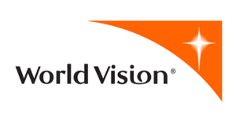

```{r, set-options, echo = FALSE, cache = FALSE}
knitr::opts_chunk$set(
 eval = T, # run all code
 echo = F, # show code chunks in output 
 tidy=T, # make output as tidy
 message = F,  # mask all messages
 warning = F, # mask all warnings 
 out.width="100%",
 size="small",
 knitr::opts_chunk$set(fig.pos = 'H')
)
# get device output size
# dev.size("px")
```

<!-- ____________________________________________________________________________ -->
<!-- start body -->

---

```{r,out.width=params$width,out.height=params$height}
require(leaflet)
latlon <- c(33.79667, -84.32346) # emory
ecc_label <- "This should be working"
ecc_popup <- "Take the elevator to the second floor, \nthen exit left and take the first left."
map <- leaflet() # initiate the leaflet map object
map <- addTiles(map) # add the actual map tiles to the leaflet object
map <- addMarkers(map,latlon[2],latlon[1],label=ecc_label,popup=ecc_popup) 
map 
```


<!-- ________________________________________________________ slide break -->
## Some places I've worked {data-background="black"}

<!-- ________________________________________________________ slide break -->
---

```{r,echo=F,results='hide'}
require(RCurl)
require(RColorBrewer)
require(dplyr)
require(plotly)
script <- getURL("https://raw.githubusercontent.com/darwinanddavis/plot_it/master/plot_it.R", ssl.verifypeer = FALSE)
  eval(parse(text = script))
  # Set global plotting parameters
  cat("plot_it( \n0 for presentation, 1 for manuscript, \nset colour for background, \nset colour palette 1. use 'display.brewer.all()', \nset colour palette 2. use 'display.brewer.all()', \nset alpha for colour transperancy, \nset font style \n)")
  plot_it(0,"blue","Set3","Spectral",0.8,"") # set plot function params       
  plot_it_gg("black","white") # same as above for ggplot 
```

## {data-background="black"} 

```{r,out.width=params$width,out.height=params$height,warning=F,message=F}
resource_type <- "detritus"
memi_df <- readr::read_csv("https://github.com/darwinanddavis/reveal_test/raw/master/data/memi_df.csv")
memi_df <- data.frame(memi_df)
# heatmap -----------------------------------------------------------------
require(viridis)
require(ggthemes)
require(plotly)

me_day_vec <- c("skip30","skip60","skip90","skip120")
me_day_names <- as.factor(c("Skip~30", "Skip~60", "Skip~90", "Skip120")) # char vec for labelling facets

ttl <- ""
subttl = ""
xlab <- "Time (days)"
ylab <- "Control intensity"
# turn names into function for labeller for facets
me_im_names <- c("No control","50%", "75%", "90%", "95%", "99%")
dens <- memi_df[,"Cercs"]
yy <- memi_df[,"ControlImpact"]
xx <- memi_df[,"Time"]
facet1 <- memi_df[,"ControlDay"]
p <- ggplot(memi_df,aes(x=xx,y=yy,fill=dens)) +
  geom_tile(colour= "gray",size=0.01, width=2, linetype = 0) +
  scale_fill_viridis(name="Density",option ="magma")
p <- p + facet_wrap(~ ControlDay_names,nrow=length(me_day_names), ncol=1, drop= F, labeller=label_parsed) # use for adding facet labels
# p <-p + facet_wrap(facet1, nrow=3, ncol=1, drop= F)
p <- p + scale_y_continuous(breaks = unique(yy), labels = me_im_names, trans = "reverse")
p <- p + scale_x_continuous(breaks = seq(0,max(xx),30), expand =c(0,2)) 
p <- p + geom_segment(aes(x = 152, xend = 152, y= 4, yend= 4),
                      arrow=arrow(length=unit(0.2,"cm")))
p <- p + theme_calc() + 
  theme(text = element_text(size=18)) +
  # labs(title= paste0("Density of ",ttl, " by ",subttl), y=ylab, x=xlab) +
  labs(title = paste0("\n","\n",ttl), y=ylab, x=xlab,size=3) +
  theme(plot.title = element_text(vjust=-7)) +
  theme(legend.position = "bottom",legend.direction = "horizontal") +
  theme(legend.text = element_text(size=12)) +
  plot_it_gg("black","white") 
ggplotly(p)

```


<!-- ________________________________________________________ slide break -->
## Places I've lived {data-background="black"}  

<!-- ________________________________________________________ slide break -->
## {data-background="#262626"} 

```{r,world,out.width=params$width,out.height=params$height}
require(leaflet)  
require(dplyr)

# airbnb data 
# amdam <- read.csv("data/amdam_small.csv",header=T,sep=",",stringsAsFactors = T) 
# amdam <- read.csv("data/mp.csv",header=T,sep=",",stringsAsFactors = T) 
amdam <- readr::read_csv("https://raw.githubusercontent.com/darwinanddavis/reveal_test/master/data/mp.csv")

# mp <- data.frame("name" = c("Melbourne","Medellin","Leipzig"),
#            ll
#            )
# write.csv(mp,"/Users/malishev/Documents/Data/reveal_test/reveal_test/data/mp.csv")
amdam <- data.frame(amdam)
par(bg="black")
colv <- "orange"
site_names <- paste0("City: ",amdam$name) 
map <- leaflet() %>% 
  setView(amdam[1,"longitude"],amdam[1,"latitude"],zoom=4) %>% 
  addTiles() %>% 
  addCircleMarkers(amdam[,"longitude"],
                   amdam[,"latitude"],
                   radius = 10,
                   stroke = TRUE,
                   weight = 3, 
                   opacity = 0.5,
                   color = colv,
                   fillColor = colv,
                   label=site_names,
                   popup=site_names) %>%
  addProviderTiles(
    "CartoDB.DarkMatter"
    # "Stamen.TonerLite"
    )
map
# names(providers)

```

<!-- ________________________________________________________ slide break -->
# Programming stuff I've picked up {data-background="black"}  

<!-- ________________________________________________________ slide break -->
---

- R/Rmd   
- Linux  
- git/Github  
- Python  
- MATLAB  
- HTML  
- CSS  
- XML  
- plotly  
- LaTeX  
- Netlogo  


**In 2010**, I worked at World Vision Australia as a climate policy researcher  

  

<br> 

I developed and published National Adaptation Programmes of Action (NAPAs) for climate risk areas in Mozambique and Tanzania, Africa.  


<!-- ________________________________________________________ slide break -->
---

Then in 2011 I become President of Embrace Education, a not-for-profit organisation teaching literacy and math to refugee and disadvantaged youths in schools throughout Melbourne, Australia. 


<!-- ________________________________________________________ slide break -->
---

In 2012, I started my PhD in ecological modelling.   


I built simulation models based on metabolic theory of energy and mass balances to forecast dispersal of animals in space and time under climate change. Think model building, data mining and analysis, lots of math and stats, and even more writing.  

<br> 

I also learnt these ...  

<!-- ________________________________________________________ slide break -->
---

- R/Rmd   
- Linux  
- git/Github  
- Python  
- MATLAB  
- HTML  
- CSS  
- XML  
- plotly  
- LaTeX  
- Netlogo  

     
<!-- ________________________________________________________ slide break -->
---

In 2013, I moved to Amsterdam, Netherlands, as a visiting researcher to work in theoretical ecology at the Vrije University.    


<!-- ________________________________________________________ slide break -->
## {data-transition="fade" data-background=#00589C}

Then I relocated to the Helmholtz UFZ in Leipzig, Germany, to work in spatial simulation modelling.    


<!-- ________________________________________________________ slide break -->
---

and I presented seminars and gave invited talks about my work here ...  

<!-- ________________________________________________________ slide break -->
---

(map of conference locations)  

<!-- ________________________________________________________ slide break -->
---  

**Nowadays**    

I’m a computational researcher at Emory University with a background in simulation modelling.   

<br>  

I work on a bunch of diverse data projects ranging from forecasting human disease risk to bioenergetics modelling to spatial modelling of species ranges.    

Freelance copy-editor, Uni-edit      

## {data-transition="fade"}

Then in 2017 I relocated here and finished my PhD

```{r}
# leaflet of mde
```

<!-- ## {data-background=#000}  -->
## {data-transition="fade"}


<!-- __________ heading __________   -->
## <br> <br> Here are some of things I'm interested in ... {data-background="#000000"}     

## Modelling and number crunching 

## Data viz  

## Building research tools  


## Some of my projects  

---

spatial

---

## {data-background-iframe='https://darwinanddavis.github.io/EmoRyCodingClub/index.html'}

---

disease (joyplots)


<!-- horizontal slide -->
# Slide styling  

--- 

## Change background colour {data-background=#f66a0a} 

---

## Image background {data-background="img/mars.jpg"}

---

## Video background {data-background-video="img/git_rproj.mp4" data-background=#000000}

### Visible in online browser  

---

## Use an online page as b/g {data-background-iframe="https://github.com/darwinanddavis"}

<!-- horizontal slide -->
# More options

--- 

[https://github.com/rstudio/revealjs](https://github.com/rstudio/revealjs)  

[Justify text](https://github.com/hakimel/reveal.js/issues/18)

`<section style="text-align: left;">`  


<!-- end body -->  
<!-- ____________________________________________________________________________ -->
